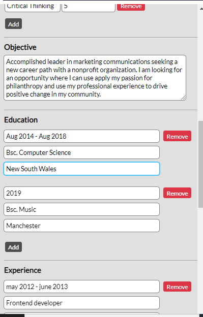
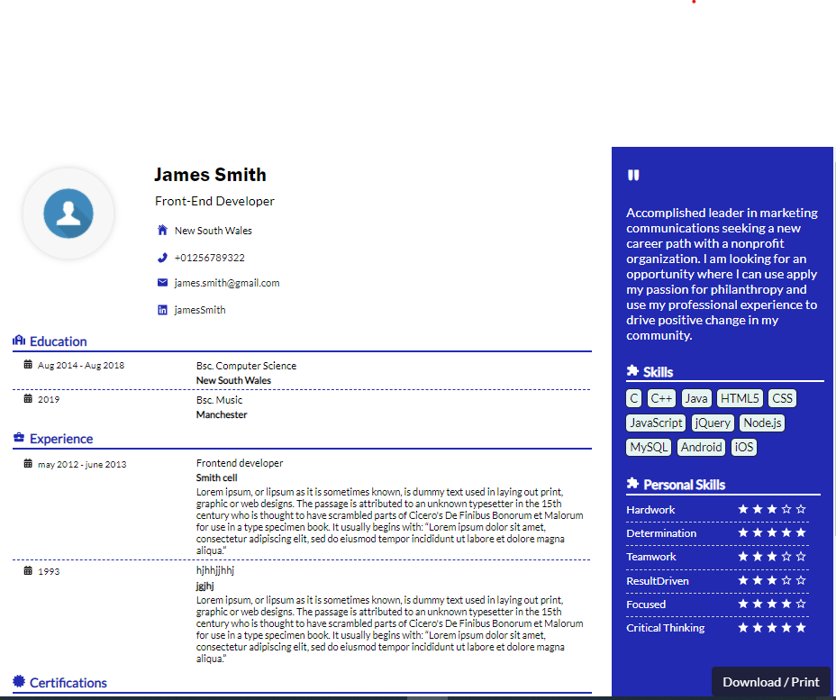

# CV Builder

## Project Objective
 An application that accepts a job seeker's information and renders as a properly formatted cv.

 ## Customer Requirement

### Links

- Solution URL: [https://github.com/blankwriter/cv-builder.git](https://github.com/blankwriter/cv-builder.git)
- Live Site URL: [https://www.netlify.com/](https://capable-scone-d98d5e.netlify.app/)

### Built with

[React](https://reactjs.org/) - JS library
[React Router](https://reactrouter.com/) - For user interfaces
[dart sass](https://sass-lang.com/dart-sass) - For Style
[React Icons](https://react-icons.github.io/react-icons/) - For icons

## Screenshot

## Author
 GitHub - [blankwriter](https://github.com/blankwriter)